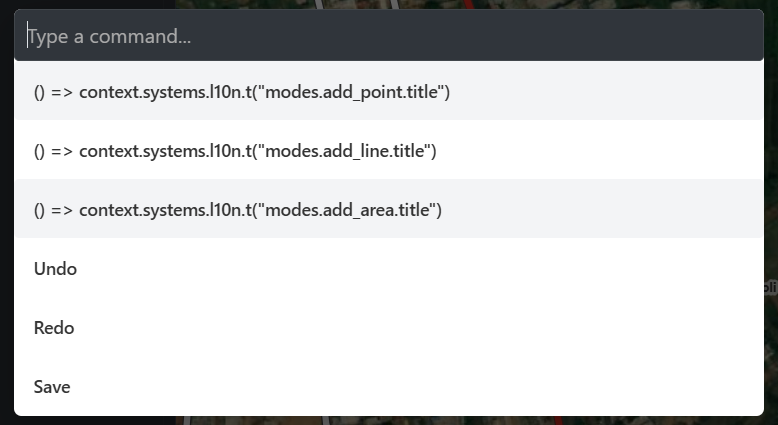

i have faced this issue beacuse its i didnt knew about l10n.

firstly i thought to hardcode the title in the code, but that would cretae the problem of languages

after that i thought of making a different kbar.json file in data to import names like "add a point", "add a line",.... but that would create a same problem of languages- i cannot create a json file that would contain data in 50 different languages.

Then i learnt about l8n, what is it? what is does? why it is needed ?

In short l10n stands for localization system is a core service that loads language files, manages the active language and returns translated UI strings at runtime.

In iD, every visible string goes through l10n (button labels, toottips, mode names , error messages).
main point is to never hardcode 'Add point' , Instead it should be written as I10n.t('modes.add_point.title).

the actual text will lives in JSON files in data/locales/
